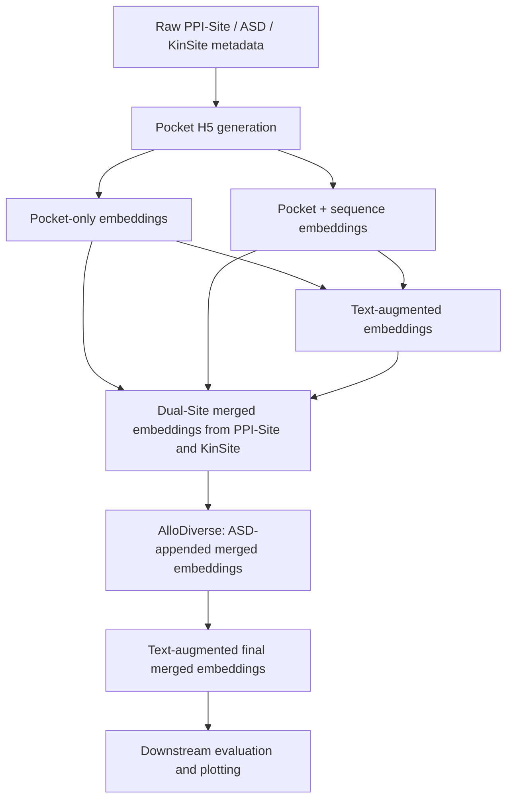

# Allostery Workflow

This document describes the allostery data preparation, embedding extraction,
merging, text-annotation, and downstream evaluation workflow in this repository.

The workflow is currently script-driven: most scripts use hardcoded paths and
configuration variables near the bottom or top of each file. Before running a
script, check and update its input paths, output names, model name, checkpoint,
configuration file, and radius/count settings.

## Repository Layout

```text
src/allostery/
  generating_pockets/     Build pocket H5 files from PPI-Site, ASD, and KinSite inputs
  extract_embeddings/     Extract pocket, sequence, text, and merged embeddings
  text_annotations/       Collect UniProt/PDB text annotations for text embeddings
  utils/                  Split, merge, balancing, label, and evaluation utilities
  plotting/               Plotting and source-data scripts for downstream results
configs/
  collect_embeddings.yaml Model names, config paths, and checkpoint paths
```

## Quick Start

Depending on your goal, follow the corresponding workflow:

1. **Set up the execution environment** → [Environment](#environment)
2. **Train the original OneProt model** → [Original OneProt](#original-oneprot)
3. **Use the molecular dynamics extension** → [OneProt MD extension](#md-extension)
4. **Reproduce the allostery study** → [Allostery prediction with OneProt](#allostery-paper)

The allostery workflow consists of:

1. **Generate binding pockets** → [`src/allostery/pocket_generation/`](src/allostery/) *(or the appropriate subdirectory)*
2. **Extract OneProt embeddings** → [`src/allostery/extract_embeddings/`](src/allostery/)
3. **Train downstream classifiers** → [`src/allostery/`](src/allostery/)
4. **Reproduce manuscript figures and analyses** → [`src/allostery/`](src/allostery/)
5. **Download pretrained checkpoints, processed pocket files (`.h5`), and dataset splits** → [Zenodo](https://doi.org/10.5281/zenodo.20997998)

## High-Level Data Flow



## General Prerequisites

- Run scripts from the repository root, for example:

  ```bash
  cd oneprot-embeddings
  ```

- If imports such as `src.models.oneprot_module` fail, set:

  ```bash
  export PYTHONPATH="$PWD:$PYTHONPATH"
  ```

- Pocket generation scripts download PDB files and need network access unless
  the structures are already cached in `pdb_files/`.

- Text annotation scripts call RCSB and UniProt APIs. 

- Embedding extraction scripts need the OneProt environment, PyTorch,
  torch-geometric, Hydra/OmegaConf, Transformers, h5py, pandas, NumPy, tqdm,
  Biopython, SciPy, and the trained model checkpoints.

- Embedding scripts are GPU-capable and should usually run inside the intended
  container/environment on a GPU node.

- Many scripts set:

  ```python
  torch.set_num_threads(1)
  os.environ["OMP_NUM_THREADS"] = "1"
  os.environ["MKL_NUM_THREADS"] = "1"
  ```

  Keep these settings unless there is a reason to change threading behavior.

## Important Naming Notes

- The PPI-site embedding output folders are named `ASD_pockets` and
  `ASD_pockets_sequence` in the current scripts. This is inherited naming in
  the scripts, not a typo in this documentation.

- H5 scripts open output files in append mode in several places. Use a fresh
  output filename for each run, especially when changing radius/count values.


## Model Configuration

For embedding extraction, update these values before each model run:

```python
model_name = "..."
config_path = "..."
checkpoint_path = "..."
```

The model names, config paths, and checkpoint paths are collected in zenodo and need to be added to:

```text
configs/collect_embeddings.yaml
```

Search that file by model name and copy the matching `config_path` and
checkpoint path into the script you are running.

Models listed in the workflow note:

```text
Pocket+Text (oneprot_pocket_text_32900)
Pocket+Text+SG+ST (oneprot_full_allatom_no_seqsim_no_l1_A100_32900_sanity)
Pocket+Text+ST+MD (oneprot_md_combined_gpcr_no_struct_graph_32900)
Pocket+Text+SG+MD (oneprot_md_combined_gpcr_no_struct_token_32900)
Pocket+Text+SG (oneprot_struct_graph_pocket_text_32900)
Pocket+Text+SG+ST+MD (oneprot_md_combined_gpcr_32900)
Pocket+Text+ST (oneprot_struct_token_pocket_text_32900)
```

## Stage 1: Generate Pocket H5 Files

Pocket H5 files are the structural inputs used by the embedding scripts. Run
the generation scripts separately for each desired pocket radius/count, default is 100.

### PPI-site Pockets

Script:

```text
src/allostery/generating_pockets/extract_pocket_seq_to_h5.py
```

Purpose:

- Parses PPI-site cavity annotations.
- Downloads/loads PDB structures.
- Finds ligand centers.
- Extracts nearby pocket atoms/residues using `count`.
- Writes a pocket sequence H5 file.

Inputs from the workflow:

```text
PL_part8_20230317_matrix_liganded_allosteric.csv
PL_part8_20230317_matrix_liganded_orthosteric_competitive.csv
```

Edit near the bottom of the script:

```python
annotations_file = "..."
process_annotations_batch(annotations_file, "...output_name.h5", count=100)
```

Example command:

```bash
python src/allostery/generating_pockets/extract_pocket_seq_to_h5.py
```

### ASD Pockets

Script:

```text
src/allostery/generating_pockets/allosteric_labels_pockets.py
```

Purpose:

- Reads ASD PDB train/test CSVs.
- Extracts allosteric pocket centers from residue labels.
- Writes labeled pocket H5 groups.

Default inputs in the script:

```text
ASD_original_splits/train_df_pdb.csv
ASD_original_splits/test_df_pdb.csv
```

Edit near the bottom:

```python
csv_files = [...]
output_h5 = "ASD_binding_pockets.h5"
process_multiple_csv_files(
    csv_files=csv_files,
    output_h5=output_h5,
    count=100,
    cluster_distance=10.0,
    output_dir="pdb_files",
)
```

Example command:

```bash
python src/allostery/generating_pockets/allosteric_labels_pockets.py
```

### KinSite Pockets

Script:

```text
src/allostery/generating_pockets/extract_pockets_seqs_csv.py
```

Purpose:

- Reads kinase inhibitor metadata from an Excel-like input file.
- Splits rows by mechanism.
- Writes competitive and allosteric H5 files.

Edit near the bottom:

```python
excel_file = "Allosteric_and_competitive_inhibitors.csv-1.xls"

process_excel_file(
    excel_file=excel_file,
    competitive_h5="competitive_pockets_kinsite.h5",
    allosteric_h5="allosteric_pockets_kinsite.h5",
    count=100,
)
```

Example command:

```bash
python src/allostery/generating_pockets/extract_pockets_seqs_csv.py
```

## Stage 2: Collect Text Annotations

Run these before any text-augmented embedding step.

### PL8 Text Annotations

Script:

```text
src/allostery/text_annotations/text_annotations_PL8.py
```

Purpose:

- Parses PPI-site cavity IDs.
- Maps cavity IDs to UniProt IDs.
- Fetches UniProt annotations.
- Writes split text files with annotation text.

Edit:

```python
SPLIT_DIR = "..."
CSV_FILE = "..."
SPLITS = ["train", "valid", "test"]
```

The script is configured for one mechanism at a time. Run it separately for
allosteric and competitive split directories/CSV files if both mechanisms are
needed.

Expected output format:

```text
split_id | uniprot_id | annotation_text
```

### KinSite Text Annotations

Script:

```text
src/allostery/text_annotations/text_annotations_kinase.py
```

Purpose:

- Reads kinase split CSVs from `KinSite_splits`.
- Fetches UniProt annotation text.
- Writes `train_text.csv`, `valid_text.csv`, and `test_text.csv`.

Required columns:

```text
Uniprot ID
h5_identifier
```

Edit:

```python
SPLIT_DIR = "KinSite_splits"
UNIPROT_COL = "Uniprot ID"
H5_COL = "h5_identifier"
```

### ASD Text Annotations

Script:

```text
src/allostery/text_annotations/text_annotations_ASD.py
```

Purpose:

- Reads ASD PDB CSVs.
- Uses RCSB GraphQL to map PDB chains to UniProt IDs.
- Fetches UniProt annotation text.
- Writes text-augmented PDB CSVs.

Default inputs:

```text
ASD_original_splits/train_df_pdb.csv
ASD_original_splits/test_df_pdb.csv
```

Expected outputs:

```text
train_df_pdb_text.csv
test_df_pdb_text.csv
```

## Stage 3: Extract PPI-site Embeddings

Before running each script, update the H5 file paths to point to the H5 files
generated for the desired radius/count.

### PPI-site Pocket-Only Embeddings

Script:

```text
src/allostery/extract_embeddings/extract_embeddings_pockets.py
```

Purpose:

- Loads PPI-site pocket H5 files.
- Reads allosteric and competitive split IDs.
- Runs the model pocket branch.
- Saves pocket-only `.pt` embeddings.

Edit in `__main__`:

```python
model_name = "..."
config_path = "..."
checkpoint_path = "..."

h5_files = {
    "allosteric": "...allosteric.h5",
    "competitive": "...competitive.h5",
}

split_dirs = {
    "allosteric": ".../splits/allosteric",
    "competitive": ".../splits/competitive",
}

output_dir = "embeddings/" + model_name + "/ASD_pockets/"
```

Output pattern:

```text
embeddings/<model_name>/ASD_pockets/<split>/ASD_pockets_<split>_embeddings_labels.pt
```

Example command:

```bash
python src/allostery/extract_embeddings/extract_embeddings_pockets.py
```

### PPI-site Pocket + Sequence Embeddings

Script:

```text
src/allostery/extract_embeddings/extract_embeddings_pocket_sequence.py
```

Purpose:

- Loads PPI-site pocket sequence H5 files.
- Extracts pocket embeddings and sequence embeddings.
- Concatenates pocket and sequence representations.
- Saves `.pt` embeddings.

Edit in `__main__`:

```python
model_name = "..."
config_path = "..."
checkpoint_path = "..."

h5_files = {
    "allosteric": "...allosteric.h5",
    "competitive": "...competitive.h5",
}

split_dirs = {
    "allosteric": ".../splits/allosteric",
    "competitive": ".../splits/competitive",
}

output_dir = "embeddings/" + model_name + "/ASD_pockets_sequence/"
```

Output pattern:

```text
embeddings/<model_name>/ASD_pockets_sequence/<split>/ASD_pockets_sequence_<split>_embeddings_labels.pt
```

This script resolves the sequence tokenizer from the model config, local
Hugging Face cache, or common cluster cache paths. If tokenizer loading fails,
pre-download the tokenizer or set `HF_HOME`.

### Add Text to PL8 Embeddings

Script:

```text
src/allostery/extract_embeddings/text_embeddings_PL8.py
```

Purpose:

- Loads existing PPI-site pocket-only and pocket+sequence `.pt` files.
- Loads PPI-site annotation text from split text files.
- Encodes text using the model text branch.
- Concatenates text embeddings onto existing embeddings.

Edit near the top:

```python
MODEL_DIR = "embeddings/<model_name>"
SPLIT_DIRS = {
    "allosteric": ".../splits/allosteric",
    "competitive": ".../splits/competitive",
}
MECHANISM_ORDER = [("allosteric", 1), ("competitive", 0)]
CONFIG_PATH = "..."
CHECKPOINT_PATH = "..."
TOKENIZER_SNAPSHOT = "..."
```

Source to output mapping:

```python
SOURCE_TYPES = {
    "ASD_pockets": "ASD_pockets_text",
    "ASD_pockets_sequence": "ASD_pockets_sequence_text",
}
```

Output patterns:

```text
embeddings/<model_name>/ASD_pockets_text/<split>/ASD_pockets_text_<split>_embeddings_labels.pt
embeddings/<model_name>/ASD_pockets_sequence_text/<split>/ASD_pockets_sequence_text_<split>_embeddings_labels.pt
```

Example command:

```bash
python src/allostery/extract_embeddings/text_embeddings_PL8.py
```

## Stage 4: Extract Kinase Embeddings

### Kinase Pocket and Pocket + Sequence Embeddings

Script:

```text
src/allostery/extract_embeddings/extract_embeddings_pocket_seq_kinase.py
```

Purpose:

- Loads kinase competitive/allosteric H5 files.
- Reads split CSVs containing `Mechanism` and `h5_identifier`.
- Extracts pocket-only embeddings.
- Extracts pocket+sequence combined embeddings.

Edit in `__main__`:

```python
config_path = "..."
checkpoint_path = "..."
model_name = "..."

competitive_h5 = "competitive_pockets_csv.h5"
allosteric_h5 = "allosteric_pockets_csv.h5"
split_dir = "KiSite_splits"
output_dir = "embeddings/" + model_name
```

Output patterns:

```text
embeddings/<model_name>/Kinase_pocket/<split>/Kinase_pocket_<split>_embeddings_labels.pt
embeddings/<model_name>/Kinase_combined/<split>/Kinase_combined_<split>_embeddings_labels.pt
```

Example command:

```bash
python src/allostery/extract_embeddings/extract_embeddings_pocket_seq_kinase.py
```

### Add Text to Kinase Embeddings

Script:

```text
src/allostery/extract_embeddings/extract_text_embeddings_kinase.py
```

Purpose:

- Loads `Kinase_pocket` and `Kinase_combined` `.pt` files.
- Loads kinase `*_text.csv` files.
- Encodes annotation text.
- Writes text-augmented kinase embeddings.

Edit near the top:

```python
MODEL_DIR = "embeddings/<model_name>"
SPLIT_DIR = "0.3"
CONFIG_PATH = "..."
CHECKPOINT_PATH = "..."
H5_ID_COL = "h5_identifier"
MECHANISM_COL = "Mechanism"
```

Source to output mapping:

```python
SOURCE_TYPES = {
    "Kinase_pocket": "Kinase_pocket_text",
    "Kinase_combined": "Kinase_combined_text",
}
```

Output patterns:

```text
embeddings/<model_name>/Kinase_pocket_text/<split>/Kinase_pocket_text_<split>_embeddings_labels.pt
embeddings/<model_name>/Kinase_combined_text/<split>/Kinase_combined_text_<split>_embeddings_labels.pt
```

Example command:

```bash
python src/allostery/extract_embeddings/extract_text_embeddings_kinase.py
```

## Stage 5: Merge PPI-site and KinSite Embeddings

Script:

```text
src/allostery/extract_embeddings/merge_embeddings_text.py
```

Purpose:

- Merges compatible PPI-site and kinase embeddings within each model directory.
- Writes merged pocket, pocket+sequence, text, and non-text variants.
- Preserves labels after applying explicit label maps.

Configured merge pairs:

```python
MERGE_PAIRS = [
    ("Kinase_pocket_text", "ASD_pockets_text", "merged_pocket_text"),
    ("Kinase_combined_text", "ASD_pockets_sequence_text", "merged_pocket_sequence_text"),
    ("Kinase_pocket", "ASD_pockets", "merged_pocket"),
    ("Kinase_combined", "ASD_pockets_sequence", "merged_pocket_sequence"),
]
```

Label maps:

```python
KINASE_LABEL_MAP = {0: 0, 1: 1}
ASD_LABEL_MAP = {0: 0, 1: 1}
```

Important:

- The script currently finds eligible model directories, but the main loop is
  hardcoded to:

  ```python
  for model_dir in ["embeddings/oneprot_md_combined_gpcr_no_struct_graph_32900"]:
  ```

  Edit this list for a single model or change it back to `for model_dir in
  model_dirs:` for a full sweep.

Output patterns:

```text
embeddings/<model_name>/merged_pocket/<split>/merged_pocket_<split>_embeddings_labels.pt
embeddings/<model_name>/merged_pocket_sequence/<split>/merged_pocket_sequence_<split>_embeddings_labels.pt
embeddings/<model_name>/merged_pocket_text/<split>/merged_pocket_text_<split>_embeddings_labels.pt
embeddings/<model_name>/merged_pocket_sequence_text/<split>/merged_pocket_sequence_text_<split>_embeddings_labels.pt
```

Example command:

```bash
python src/allostery/extract_embeddings/merge_embeddings_text.py
```

## Stage 6: Extract ASD Embeddings

ASD uses the H5 generated by `allosteric_labels_pockets.py`.

### ASD Pocket-Only Embeddings

Script:

```text
src/allostery/extract_embeddings/extract_embeddings_pockets_ASD.py
```

Purpose:

- Loads ASD labeled pocket H5.
- Maps PDB IDs from train/test CSVs to H5 identifiers.
- Extracts pocket embeddings.
- Uses labels stored in the H5 file.

Edit in `__main__`:

```python
model_name = "..."
config_path = "..."
checkpoint_path = "..."

h5_file = ".../ASD_binding_pockets.h5"
train_csv = ".../train_df_pdb.csv"
test_csv = ".../test_df_pdb.csv"
output_dir = "embeddings"
```

Output pattern:

```text
embeddings/<model_name>/ASD_pockets100/<split>/ASD_pockets100_<split>_embeddings_labels.pt
```

The folder name is currently `ASD_pockets100` even if the H5 was generated with
a different `count`. Rename the output folder/prefix in the script if you need
the name to reflect `count=50` or `count=20`.

Example command:

```bash
python src/allostery/extract_embeddings/extract_embeddings_pockets_ASD.py
```

### ASD Pocket + Sequence Embeddings

Script:

```text
src/allostery/extract_embeddings/extract_pocket_sequence_embeddings_ASD.py
```

Purpose:

- Loads ASD labeled pocket H5.
- Loads sequences from train/test CSVs.
- Extracts pocket embeddings and sequence embeddings.
- Concatenates pocket and sequence representations.

Edit in `__main__`:

```python
model_name = "..."
config_path = "..."
checkpoint_path = "..."

h5_file = ".../ASD_binding_pockets.h5"
train_csv = ".../train_df_pdb.csv"
test_csv = ".../test_df_pdb.csv"
output_dir = "embeddings"
```

Output pattern:

```text
embeddings/<model_name>/ASD_pocket_sequence100/<split>/ASD_pocket_sequence100_<split>_embeddings_labels.pt
```

As above, the folder name contains `100` by default. Rename it if the run uses
another count.

Example command:

```bash
python src/allostery/extract_embeddings/extract_pocket_sequence_embeddings_ASD.py
```

## Stage 7: Append ASD Embeddings to the Merged Sets

Script:

```text
src/allostery/extract_embeddings/create_merged_files.py
```

Purpose:

- Iterates through model directories under an embeddings root.
- Copies `merged_pocket` to `ASD_merged_pocket`.
- Appends `ASD_pockets100` embeddings to the copied files.
- Copies `merged_pocket_sequence` to `ASD_merged_pocket_sequence`.
- Appends `ASD_pocket_sequence100` embeddings to the copied sequence files.

Default input root:

```text
embeddings
```

Run with the default root:

```bash
python src/allostery/extract_embeddings/create_merged_files.py
```

Run with an explicit root:

```bash
python src/allostery/extract_embeddings/create_merged_files.py embeddings
```

Expected source folders per model:

```text
merged_pocket/
merged_pocket_sequence/
ASD_pockets100/
ASD_pocket_sequence100/
```

Output folders per model:

```text
ASD_merged_pocket/
ASD_merged_pocket_sequence/
```

Important:

- The script appends ASD rows with `labels_fitness = 1` for appended rows.
  Confirm this matches the intended label convention.

- If the source folders use names other than `ASD_pockets100` or
  `ASD_pocket_sequence100`, update `pockets100_name` and `pockets100_prefix` in
  the script.

## Stage 8: Add Text to Final ASD-Merged Embeddings

Script:

```text
src/allostery/extract_embeddings/extract_text_embeddings_merged_ASD.py
```

Purpose:

- Loads final merged pocket and pocket+sequence embeddings.
- Reconstructs row order across kinase, PL8/ASD split text, and ASD PDB tail
  rows.
- Encodes text and concatenates text embeddings to the merged embeddings.

Edit near the top:

```python
MODEL_DIR = "embeddings/<model_name>"
KINASE_SPLIT_DIR = "KinSite_splits"

ASD_SPLIT_DIRS = {
    "allosteric": ".../splits/allosteric",
    "competitive": ".../splits/competitive",
}

PDB_DATA_DIR = "..."
PDB_TRAIN_CSV = os.path.join(PDB_DATA_DIR, "train_df_pdb.csv")
PDB_TEST_CSV = os.path.join(PDB_DATA_DIR, "test_df_pdb.csv")
PDB_TRAIN_TEXT_CSV = os.path.join(PDB_DATA_DIR, "train_df_pdb_text.csv")
PDB_TEST_TEXT_CSV = os.path.join(PDB_DATA_DIR, "test_df_pdb_text.csv")

CONFIG_PATH = "..."
CHECKPOINT_PATH = "..."
TOKENIZER_SNAPSHOT = "..."
```

Source to output mapping:

```python
SOURCE_TYPES = {
    "ASD_merged_pocket": "ASD_merged_pocket_text",
    "ASD_merged_pocket_sequence": "ASD_merged_pocket_sequence_text",
}
```

Output patterns:

```text
embeddings/<model_name>/ASD_merged_pocket_text/<split>/ASD_merged_pocket_text_<split>_embeddings_labels.pt
embeddings/<model_name>/ASD_merged_pocket_sequence_text/<split>/ASD_merged_pocket_sequence_text_<split>_embeddings_labels.pt
```

Important:

- Make `ASD_MECHANISM_ORDER` consistent with `ASD_SPLIT_DIRS`. The current
  script has `noncompetitive` in `ASD_MECHANISM_ORDER` while the
  `noncompetitive` directory is commented out in `ASD_SPLIT_DIRS`. Either add
  the noncompetitive split directory or remove `noncompetitive` from
  `ASD_MECHANISM_ORDER`.

Example command:

```bash
python src/allostery/extract_embeddings/extract_text_embeddings_merged_ASD.py
```

## Stage 9: Downstream Evaluation Helper

Script:

```text
src/allostery/utils/test_f1_PL8.py
```

Purpose:

- Reads downstream result CSV files across multiple seed/checkpoint result
  directories.
- Groups by `model_type`.
- Reports average and standard deviation for `test_auc`, normalized
  `test_tp`, and normalized `test_tn`.

Edit near the top:

```python
name = "merged_pocket_binary_text_comp"
files = [...]
```

Also update the embedding path used for normalization:

```python
a = torch.load(
    f"embeddings/<model_name>/{name}/test/{name}_test_embeddings_labels.pt"
)
```

Example command:

```bash
python src/allostery/utils/test_f1_PL8.py
```

Note: the script docstring mentions `test_f1_max`, but the current code
aggregates `test_auc`, `test_tp_norm`, and `test_tn_norm`.

## Quick Validation Commands

Inspect an H5 file:

```bash
python -c "import h5py; f=h5py.File('PATH_TO_FILE.h5','r'); print(len(f.keys())); print(list(f.keys())[:5]); f.close()"
```

Inspect a `.pt` embedding file:

```bash
python -c "import torch; d=torch.load('PATH_TO_FILE.pt', map_location='cpu'); print(d.keys()); print(d['embeddings'].shape); print(d['labels_fitness'].shape); print(d['labels_fitness'].unique(return_counts=True))"
```

Check that every split exists for a folder:

```bash
find embeddings/<model_name>/<folder> -maxdepth 2 -type f -name '*.pt' | sort
```

## Recommended Run Checklist

1. Generate PPI-site H5 files for allosteric and competitive mechanisms.

2. Generate ASD H5 files`.

3. Generate KinSite H5 files for allosteric and competitive mechanisms.

4. Generate text annotation files for PPI-site, KinSite, and ASD if text embeddings
   will be used.

5. For each model:

   - Copy `model_name`, `config_path`, and `checkpoint_path` from
     `configs/collect_embeddings.yaml`.
   - Extract PPI-site pocket-only embeddings.
   - Extract PPI-site pocket+sequence embeddings.
   - Add PPI-site text embeddings.
   - Extract KinSite pocket and pocket+sequence embeddings.
   - Add KinSite text embeddings.
   - Merge PPI-site and kinase embeddings.
   - Extract ASD pocket-only embeddings.
   - Extract ASD pocket+sequence embeddings.
   - Append ASD embeddings to the merged sets.
   - Add text to final ASD-merged embeddings.

6. Validate each expected output folder contains `train`, `valid` or `val`, and
   `test` files as appropriate for that dataset.

7. Run downstream training/evaluation outside this workflow.

8. Update and run `src/allostery/utils/test_f1_PL8.py` to summarize final
   result CSVs.

## Expected Embedding Folder Summary

Per model, the workflow may create some or all of these folders:

```text
embeddings/<model_name>/
  ASD_pockets/
  ASD_pockets_sequence/
  ASD_pockets_text/
  ASD_pockets_sequence_text/
  Kinase_pocket/
  Kinase_combined/
  Kinase_pocket_text/
  Kinase_combined_text/
  merged_pocket/
  merged_pocket_sequence/
  merged_pocket_text/
  merged_pocket_sequence_text/
  ASD_pockets100/
  ASD_pocket_sequence100/
  ASD_merged_pocket/
  ASD_merged_pocket_sequence/
  ASD_merged_pocket_text/
  ASD_merged_pocket_sequence_text/
```

## Common Failure Modes

- Reusing an H5 output name can append to an old file. Use new names for each
  mechanism/count or remove the stale file intentionally before rerunning.

- Text scripts fail when annotation files are missing. Generate the corresponding
  `*_text.txt` or `*_text.csv` files first.

- Text scripts fail when `TOKENIZER_SNAPSHOT` points to a missing BiomedBERT
  cache. Update the path or pre-cache the tokenizer.

- Sequence scripts fail when the ESM tokenizer cannot be resolved locally. Set
  `HF_HOME` or hardcode a local tokenizer directory.

- Merge scripts skip a split if source embedding dimensions do not match.
  Confirm that the compared source folders were generated from compatible model
  components.

- Label conventions must be checked before merging. Current merge maps assume
  allosteric is `1` and non-allosteric/competitive is `0`.

- Some scripts use `valid` while others use `val`. Check split names before
  assuming a folder is missing.

